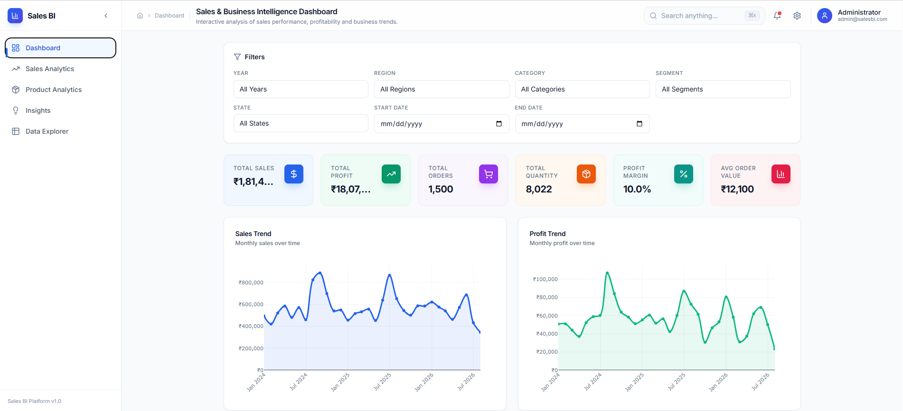

# Sales & Business Intelligence Analytics Platform

A complete, production-style Sales and Business Intelligence Analytics Platform built with Python, FastAPI, MySQL, and React. This platform transforms raw CSV sales data into actionable business insights through interactive dashboards, SQL analytics, and comprehensive reporting.


## Features

- Real CSV dataset inspection and cleaning
- MySQL database with professional schema and indexes
- FastAPI REST API with auto-generated documentation
- Interactive React dashboard with Plotly charts
- Dynamic filtering across all analytics
- Deterministic business insights engine
- CSV export of filtered data
- Power BI integration documentation
- Comprehensive analytics (regional, category, product, segment, yearly, discount)
- Professional, responsive UI with Tailwind CSS
- Loading, error, and empty states
- Data Explorer with search and pagination

## Tech Stack

### Backend
- Python 3.11+
- FastAPI
- SQLAlchemy
- Pandas, NumPy
- mysql-connector-python
- Pydantic

### Frontend
- React 18
- Vite
- Tailwind CSS
- Plotly.js (react-plotly.js)
- Framer Motion
- Lucide React
- React Router

### Database
- MySQL 8+

## Project Structure

```
Sales-Business-Intelligence-Platform/
├── backend/                    # FastAPI backend
│   ├── app/
│   │   ├── api/routes/         # API endpoints
│   │   ├── core/               # Data inspection and cleaning
│   │   ├── database/           # DB models, connection, seeder
│   │   ├── services/           # Business logic
│   │   ├── schemas/            # Pydantic schemas
│   │   └── utils/              # Formatters
│   ├── requirements.txt
│   ├── .env.example
│   └── run.py
├── frontend/                   # React frontend
│   ├── src/
│   │   ├── api/                # API client
│   │   ├── components/         # Reusable components
│   │   ├── pages/              # Page components
│   │   ├── hooks/              # Custom hooks
│   │   └── utils/              # Frontend utils
│   ├── package.json
│   ├── vite.config.js
│   └── tailwind.config.js
├── database/                   # SQL scripts
│   ├── database_setup.sql
│   └── useful_queries.sql
├── powerbi/                    # Power BI documentation
├── docs/                       # Project documentation
├── data/                       # Data folders
├── README.md
└── setup.md
```

## Dataset Information

The project uses the real CSV dataset present in the workspace:

- **File:** `sales_business_intelligence_dataset.csv`
- **Rows:** 1502
- **Columns:** 13 core + 4 derived
- **Date Range:** 2024-01-01 to 2026-08-15
- **Regions:** Central, East, North, South, West
- **Categories:** Furniture, Office Supplies, Technology
- **Segments:** Consumer, Corporate, Home Office
- **Products:** 19 unique products
- **Customers:** 221 unique customers

## Prerequisites

- Python 3.11+
- MySQL 8+
- Node.js 18+
- npm or yarn

## Setup Instructions

### 1. Clone and Navigate

```bash
cd E:\Sales-BI
```

### 2. Backend Setup

```bash
cd backend

# Create virtual environment
python -m venv venv

# Windows activation
venv\Scripts\activate

# Install dependencies
pip install -r requirements.txt

# Configure environment
copy .env.example .env
# Edit .env with your MySQL credentials

# Initialize database and import data
python run.py seed-data

# Start backend server
uvicorn app.main:app --reload --port 8005
```

### 3. Frontend Setup

```bash
cd frontend

# Install dependencies
npm install

# Start development server
npm run dev
```

### 4. Access the Application

- Frontend: http://localhost:5173
- Backend API: http://localhost:8005
- API Docs: http://localhost:8000/docs

## API Endpoints

| Method | Endpoint | Description |
|--------|----------|-------------|
| GET | `/api/health` | Health check |
| GET | `/api/dashboard/summary` | KPI summary |
| GET | `/api/dashboard/trends` | Sales/profit trends |
| GET | `/api/analytics/regions` | Regional analysis |
| GET | `/api/analytics/categories` | Category analysis |
| GET | `/api/analytics/products` | Product analysis |
| GET | `/api/analytics/customers` | Customer analysis |
| GET | `/api/analytics/segments` | Segment analysis |
| GET | `/api/analytics/yearly` | Yearly analysis |
| GET | `/api/analytics/discount` | Discount impact |
| GET | `/api/analytics/performance` | Combined analytics |
| GET | `/api/filters` | Available filter values |
| GET | `/api/insights` | Business insights |
| GET | `/api/export/csv` | Export filtered data |

## Database Schema

Database: `sales_bi_platform`
Table: `sales_data`

## Power BI Integration

See `powerbi/README.md` for instructions on connecting Power BI Desktop to the MySQL database.

## 📸 Dashboard Preview

### Main Dashboard



### Sales Analytics


### Product Analytics


### Data Explorer


### Power BI Dashboard


## Testing

```bash
# Backend
python run.py inspect-data
python run.py test-db
python run.py seed-data
```

## Documentation

- `docs/architecture.md` - System architecture
- `docs/api_documentation.md` - API reference
- `powerbi/README.md` - Power BI integration guide
- `powerbi/dax_measures.md` - DAX formulas
- `powerbi/dashboard_design.md` - Dashboard layouts

## Troubleshooting

- **MySQL connection failed:** Ensure MySQL server is running and credentials in `.env` are correct.
- **CSV not found:** Ensure `sales_business_intelligence_dataset.csv` is in the project root.
- **Port already in use:** Change ports in configuration files.
- **Frontend build errors:** Delete `node_modules` and run `npm install` again.

## Future Enhancements

- Authentication and role-based access
- Scheduled data refresh
- Advanced ML-based forecasting
- Email report delivery
- Multi-dataset support
- Dark mode support
- Mobile app
